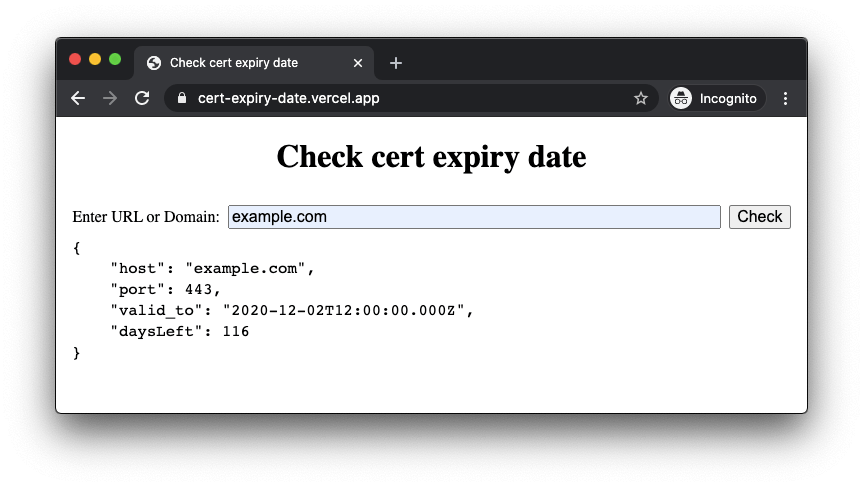

# Check cert expiry date

https://cert-expiry-date.vercel.app/



## API

The API endpoint is
`https://cert-expiry-date.vercel.app/api/cert-expiry-date`. Use the `url` query
parameter to check a domain or URL. For example,

```
$ curl -i 'https://cert-expiry-date.vercel.app/api/cert-expiry-date?url=emacs-china.org'
HTTP/2 200
content-type: application/json
cache-control: public, max-age=0, must-revalidate
date: Sat, 08 Aug 2020 11:17:13 GMT
access-control-allow-origin: *
content-length: 114
x-vercel-cache: MISS
age: 0
server: Vercel
x-vercel-id: hkg1::sfo1::vb7pt-1596885433138-f916e3cb55a1
strict-transport-security: max-age=63072000; includeSubDomains; preload

{
    "host": "emacs-china.org",
    "port": 443,
    "valid_to": "2020-08-29T14:51:45.000Z",
    "daysLeft": 21
}
```

The API supports [Cross-Origin Resource Sharing (CORS)](https://developer.mozilla.org/en-US/docs/Web/HTTP/CORS).

## Privacy

I don't store logs. However, anyone can view the realtime logs at
https://cert-expiry-date.vercel.app/_logs
